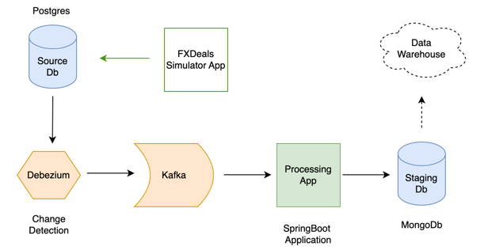

# ClusteredData Warehouse Exercise

## Assignment 
Suppose you are part of a scrum team developing data warehouse for Bloomberg to analyze FX deals. One of customer stories is to accept deals details from and persist them into DB.

### Request logic as following:

- Request Fields(Deal Unique Id, From Currency ISO Code "Ordering Currency", To Currency ISO Code, Deal timestamp, Deal Amount in ordering currency).
- Validate row structure.(e.g: Missing fields, Type format..etc. We do not expect you to cover all possible cases, but we'll look to how you'll implement validations)
- System should not import same request twice.
- No rollback allowed, what every rows imported should be saved in DB.

## Proposed architecture

Given that this is just a module in a bigger application, a few assumptions were made to make the application complete and testable

- The source database is a Postgres DB with at least one table containing the desired data details specified in the assignment question above. 
- A [change detection capture](https://debezium.io/) tool is used to write every new FX deal to a Kafka topic which is suitable for multiple consumers. Also, using kafka makes it possible to source data from multiple other sources in future.
- Our Spring application consumes message from the Kafka topic, validates them and saves the valid deals into a MongoDB database, where it could be sent to the data warehouse for analyses.

## Project setup

This project uses docker to pull and configure all the components above.
A docker-compose file is made available at the root of the project.

### Running with docker

Be sure to have docker setup on your computer. Instructions to do so can be found [here](https://docs.docker.com/get-docker/)

- Clone this repository in a suitable directory on your computer
- Navigate to the root of the project from your terminal and run `docker-compose up`
- After a downloading various components for a while, all the components should be up and running. 

## Testing the project

### Simulating deals

For the sake of completeness, a tiny bash application is included in this repository called **FX deals simulator**. Its only role is to seed the sample database with sample FX deals to enable easy testing of the functionality.

- Make the script executable using `chmod +x random_postgres_inserts.sh`
- Run the FX deals simulator using `./fx_deals_simulator.sh`
- Please note that the dummy password used in docker-compose is `rootpassword` however this can be overwritten using environment variables.

This will insert a sample deal in the postgres **sourcedb** every second. 

- To stop the script, you can press `Ctrl+C` in the terminal.

- Processed and saved deals can be seen via the mongo-express web UI `localhost:8082`

### Unit testing

The main SpringBoot application contains unit tests that could be run using gradle.

- Navigate to the root of the project from your terminal and run `./gradlew test` 
- A full test coverage report can be generated using [Jacoco](https://www.jacoco.org/jacoco/trunk/doc/index.html)

## Project tools and dependencies

| Dependency                      | Version  | Description                                                          |
|---------------------------------|----------|----------------------------------------------------------------------|
| JDK                             | 17.x.x   | Main platform                                                        |
| Gradle                          | 8.5      | Build tool                                                           |
| SpringBoot                      | 3.2.0    | Main application framework                                           |
| debezium/postgres               | 16       | Docker image of postgresdb prconfigured for change detection capture |
| Mongo                           | 5.0.23   | Docker image of MongoDB                                              |
| mongo-express                   | 1.0.0-18 | Docker image of GUI tool access MongoDB database in browser          |
| confluentinc/cp-zookeeper       | 7.4.3    | Docker image of Apache zookeeprer Cluster management server          |
| confluentinc/cp-kafka           | 7.4.3    | Docker image of Apache Kafka server                                  |
| debezium/connect                | 2.4      | Docker image of Change Detection Capture tool for ETL applications   |
| confluentinc/cp-schema-registry | 6.2.13   | Docker image of tool to manage and validate kafka topic schemas      |
| jacoco                          | latest   | Gradle plugin to generate test coverage reports                      |
| spotbugs                        | 6.0.4    | Gradle plugin for finding bugs in java code                          |
| checkstyle                      | latest   | Gradle plugin for static code analysis                               |
